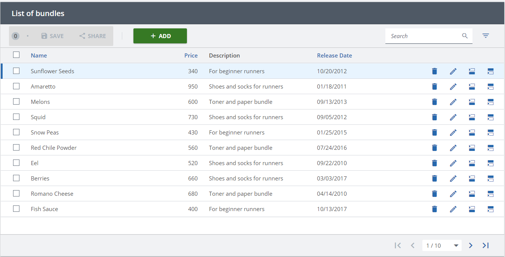
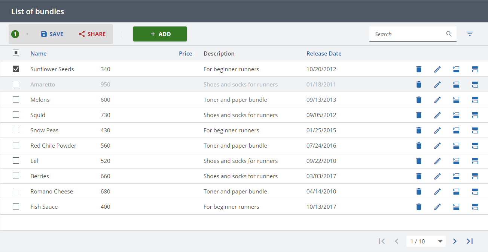

////
SPDX-License-Identifier: EUPL-1.2 OR LicenseRef-commercial
Copyright (c) 2012-2026 mgm technology partners GmbH
Dual License
This source file is part of the mgm A12 Platform and available under a choice of two different licenses:
1. Open-Source License - EUPL v1.2
You may redistribute and/or modify this file under the terms of the European Union Public License, version 1.2 - see https://eupl.eu/.
2. Commercial License
Alternatively, you may obtain a commercial license from mgm technology partners GmbH, that permits use of this software under different terms (including support and maintenance services).

Please contact a12-license@mgm-tp.com for more information.
    
You must select and comply with exactly one of the above license options.

Warranty Disclaimer (applies to either option)
THIS SOFTWARE IS PROVIDED "AS IS" AND WITHOUT WARRANTY OF ANY KIND, WHETHER EXPRESS OR IMPLIED, INCLUDING BUT NOT LIMITED TO THE WARRANTIES OF MERCHANTABILITY, FITNESS FOR A PARTICULAR PURPOSE AND NON-INFRINGEMENT, EXCEPT WHERE SUCH DISCLAIMERS ARE HELD TO BE LEGALLY INVALID. SEE THE RESPECTIVE LICENSE TEXT FOR DETAILS. 
////
= Row

== Active Row

In `OverviewEngine` component, the `activeRowId` prop is used to set a row active. The value passed to it should be `id` of the corresponding document.

The following example sets the row with id="0" to be active.

*Code*

[source,typescript]
----
include::./assets/typescript/features/active-row.tsx[tag="active-row-example"]
----

*Result*

[#row/row-state]
== Row State

Overview Engine supports applying certain styles including `selected`, `disabled` and `useSecondaryColor` for certain rows.

=== API

link:./assets/generated/typedoc/interfaces/view_api.OverviewEngineApi.RowState.html[rowState] is used to control the visual state of rows in the table.
This interface is a map that allows setting the desired styles for certain rows as below:

[source,typescript,title="RowState interface"]
----
include::./assets/typescript/features/row-state.tsx[tags="row-state"]
----

Each key in the map is the id of the document corresponding to a specific row. The value for the key is an object holding the styles applied to that row.
The object interface is as following:

* `selected`: specify whether the row should be selected or not. This is related to multi-selection feature.
* `useSecondaryColor`: specify if the row should have secondary color or not.
* `disabled`: specify if the row should be disabled or not.

The following example sets the rows with id values of 0, 1 and 2 to be `selected`, `disabled` and `useSecondaryColor`, respectively.

This is done by dispatching link:./assets/generated/typedoc/modules/store_internal_actions.Commands.html#setrowstate[Commands.setRowState] to update uiState.rowState.

*Code:*

[source,typescript]
----
include::./assets/typescript/features/row-state.tsx[tags="row-state-example"]
----

*Result:*

== Event Handlers

There are two event handlers for rows that can be registered by using link:./assets/generated/typedoc/interfaces/view_api.OverviewEngineApi.EventHandlers.html[eventHandlers] prop:

- `onRowClick` is used to handle when a row is clicked. This callback receives two parameters:
* `documentId` -- document id of the row that is clicked.
* `customEvent` -- that can be defined in the link:/docs/SME/sme-om-ba-docs/index.html#_default_row_action[Default Row Action].

[#row/event-handlers/onRowsSelect]
- `onRowsSelect` is used to control the multi-selection feature in Overview Engine. This is triggered when one or multiple rows are selected or deselected. It will be called with a parameter, which is an array of objects. Each object has two elements:
* `documentId` -- document id of the row that is clicked.
* `selected` -- the next expected selection state of this row.

