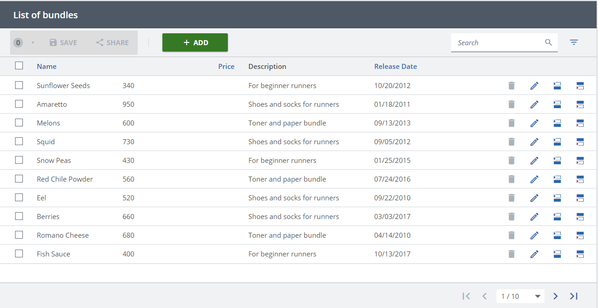
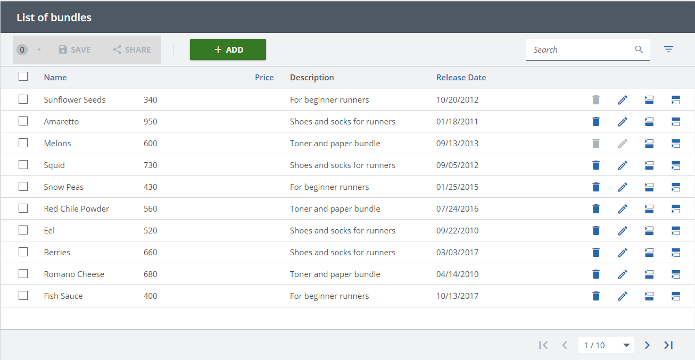
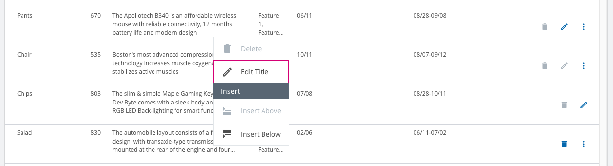

////
SPDX-License-Identifier: EUPL-1.2 OR LicenseRef-commercial
Copyright (c) 2012-2026 mgm technology partners GmbH
Dual License
This source file is part of the mgm A12 Platform and available under a choice of two different licenses:
1. Open-Source License - EUPL v1.2
You may redistribute and/or modify this file under the terms of the European Union Public License, version 1.2 - see https://eupl.eu/.
2. Commercial License
Alternatively, you may obtain a commercial license from mgm technology partners GmbH, that permits use of this software under different terms (including support and maintenance services).

Please contact a12-license@mgm-tp.com for more information.

You must select and comply with exactly one of the above license options.

Warranty Disclaimer (applies to either option)
THIS SOFTWARE IS PROVIDED "AS IS" AND WITHOUT WARRANTY OF ANY KIND, WHETHER EXPRESS OR IMPLIED, INCLUDING BUT NOT LIMITED TO THE WARRANTIES OF MERCHANTABILITY, FITNESS FOR A PARTICULAR PURPOSE AND NON-INFRINGEMENT, EXCEPT WHERE SUCH DISCLAIMERS ARE HELD TO BE LEGALLY INVALID. SEE THE RESPECTIVE LICENSE TEXT FOR DETAILS. 
////
= Row Action

== Row Action Styling

Overview Engine also provides a way to apply certain styles including `hidden` and `disabled` to row action buttons.

=== API

The `rowActionStyling` prop on `OverviewEngine` accepts a callback of type link:./assets/generated/typedoc/interfaces/view_api.OverviewEngineApi.RowActionStyling.html[OverviewEngineApi.RowActionStyling].
The callback is invoked once per row per visible action and returns the desired state for that combination — or `undefined` to leave the action unstyled.

The returned link:./assets/generated/typedoc/interfaces/view_api.OverviewEngineApi.RowActionStyling.IndividualRowActionState.html[RowActionStyling.IndividualRowActionState] controls two flags:

* `hidden` — hides the row action button for that row.
* `disabled` — disables the row action button for that row.

=== Examples

==== Disable a specific action on all rows

The following example disables the _delete_ action on every row:

[source,typescript,options="nowrap"]
----
include::./assets/typescript/features/row-action-styling.tsx[tags="row-action-styling-example-1"]
----

==== Disable an action on specific rows

The following example disables the _delete_ action only for rows with document ids `"0"` and `"2"`, and also disables the _edit_ action on row `"2"`:

[source,typescript,options="nowrap"]
----
include::./assets/typescript/features/row-action-styling.tsx[tags="row-action-styling-example-2"]
----

*Result (disable on all rows):*

*Result (disable on specific rows):*

[NOTE]
====
.Deprecated: `rowActionState` prop
`rowActionState` / `OverviewEngineApi.RowActionState` are deprecated since 2026.06 — use `rowActionStyling` instead.
They remain functional for backwards compatibility: `rowActionStyling` takes precedence per flag; only when it returns `undefined` for a flag does the engine fall back to `rowActionState`.
The two props can coexist safely during migration.
====

== Event Handlers

The on-click event of a row action can be registered by link:./assets/generated/typedoc/interfaces/view_api.OverviewEngineApi.EventHandlers.html#onrowbuttonclick-1[onRowButtonClick]
in `eventHandlers` of `OverviewEngine`. The callback receives a params object with the following fields:

- `documentId` -- document id of the row on which the action is clicked.
- `linkId` -- the link id for exclude-mode duplicate rows; `undefined` otherwise.
- `rowActionModel` -- configuration of the clicked row action, which has type link:./assets/generated/typedoc/interfaces/overview-model.OverviewModel.Button.html[Button].

== Row Actions in Right-Click Context Menu

Overview Engine also provides a built-in feature that helps end users interact with row actions easily by right-clicking on the row, instead of using row action buttons.

