////
SPDX-License-Identifier: EUPL-1.2 OR LicenseRef-commercial
Copyright (c) 2012-2026 mgm technology partners GmbH
Dual License
This source file is part of the mgm A12 Platform and available under a choice of two different licenses:
1. Open-Source License - EUPL v1.2
You may redistribute and/or modify this file under the terms of the European Union Public License, version 1.2 - see https://eupl.eu/.
2. Commercial License
Alternatively, you may obtain a commercial license from mgm technology partners GmbH, that permits use of this software under different terms (including support and maintenance services).

Please contact a12-license@mgm-tp.com for more information.

You must select and comply with exactly one of the above license options.

Warranty Disclaimer (applies to either option)
THIS SOFTWARE IS PROVIDED "AS IS" AND WITHOUT WARRANTY OF ANY KIND, WHETHER EXPRESS OR IMPLIED, INCLUDING BUT NOT LIMITED TO THE WARRANTIES OF MERCHANTABILITY, FITNESS FOR A PARTICULAR PURPOSE AND NON-INFRINGEMENT, EXCEPT WHERE SUCH DISCLAIMERS ARE HELD TO BE LEGALLY INVALID. SEE THE RESPECTIVE LICENSE TEXT FOR DETAILS. 
////
= Field-Based Filtering

Overview Engine is equipped with a feature to search for documents based on field values.
This feature can be activated or deactivated in the Overview Model, details in link:/docs/SME/sme-om-ba-docs/index.html#_enable_filter[Overview Modelling documentation - Enable Filter].

== Visualization of Filtering Feature

By default, there is a small button appears next to the Search input component: the *Filter Button*.

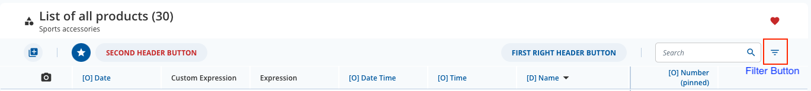

Click on this button to open the Filter Selector dialog, which shows the list of fields to configure the filter parameters.
The Apply button inside Filter Selector is responsible for triggering the filtering process, then the Filter Selector disappears and the Filter Bar is shown to display what is being filtered.

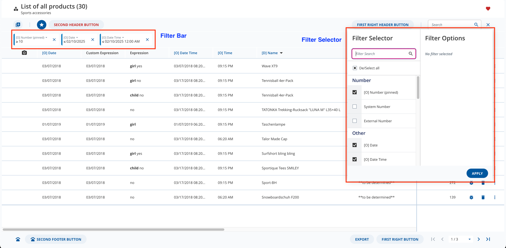

Configure the Overview Model to show/hide the Filter Button/Filter Bar, see more details in link:/docs/SME/sme-om-ba-docs/index.html#_filter_configuration[Overview Modelling documentation - Filter Configuration].

=== Filter Selector

The left side of the dialog is a list of fields from the Document Model, a list of columns, or a custom list.
It is configured by the link:/docs/SME/sme-om-ba-docs/index.html#filter_mode[Filter Mode] in the Overview Model.
Use Filter Search input to quickly find a field.

The list of fields can be grouped by sections. In the image below, the Number section contains fields related to "number".
It is easy for end users to find relevant fields to apply filters.
Read link:/docs/SME/sme-om-ba-docs/index.html#_section_data[Overview Modelling documentation - Section Data] to know how to group fields as sections.

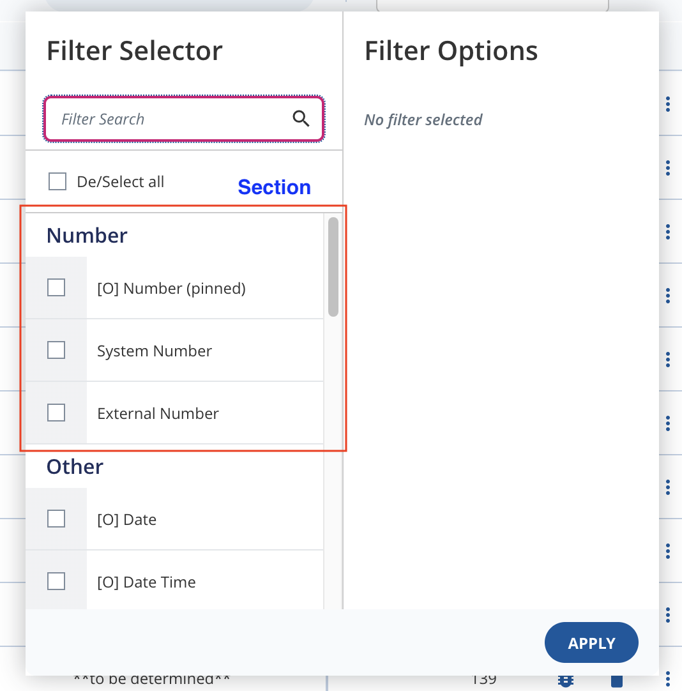

There is a checkbox inside each item of the list, which is used to mark the field to apply the filter.
When a field is checked, it becomes an *_active filter_*.

[#filter-selectors-option]
==== Filter Option

When a field is selected, the right side of the dialog shows its Filter Option.
It can be a simple input; a combination of two inputs, a range of start and end values; or a list of options.
The visualization of the Filter Option is based on field data type, see more details in <</overview-engine/field-based-filtering/supported-data-types,supported data types>>.
Below is a Filter Option for data type Number.

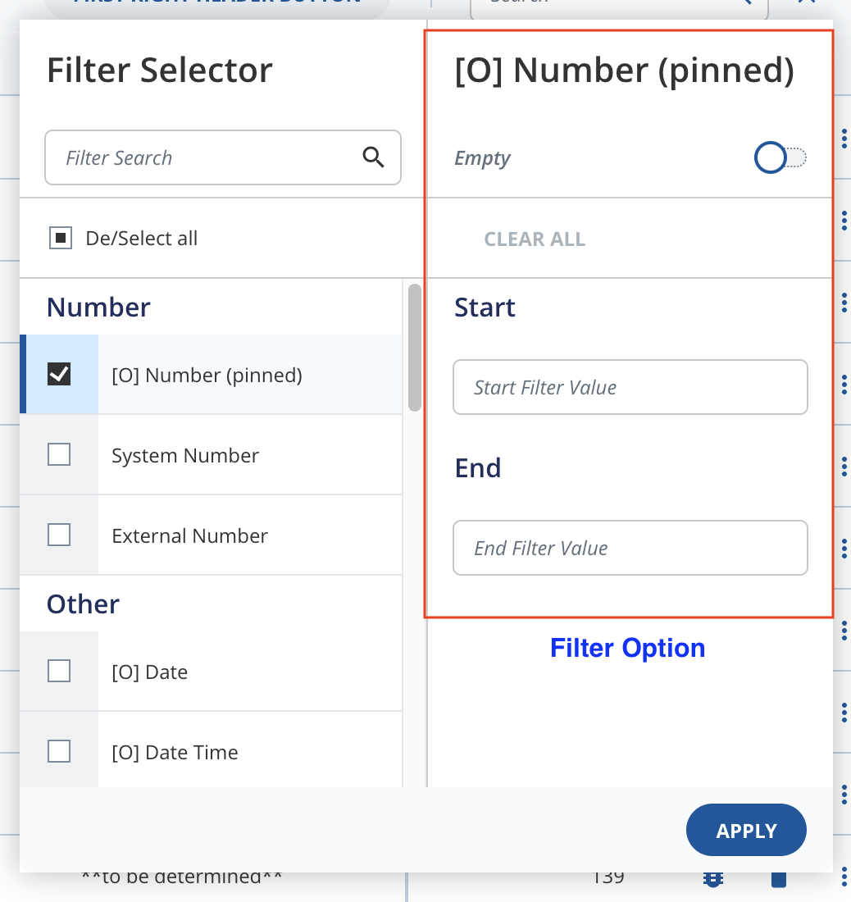

If a filter option is set, it is automatically recognized as an active filter.

==== Apply Button

The Apply button is below the Filter Option.
It triggers the filtering process for *_all active filters_* of the Filter Selector, not only the displaying Filter Option.

=== Filter Bar

The Filter Bar is presented as a group of many small boxes below the Subheader of the Overview Engine.
Each box summarizes which field is being filtered with its parameters, and a delete button to remove the corresponding filter.

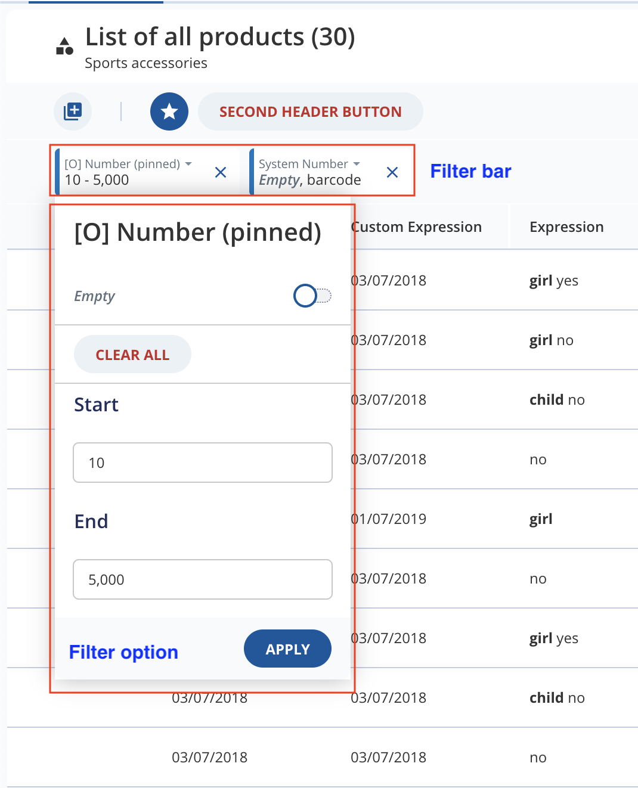

==== Filter Option

Click to a box in the Filter Bar will open a Filter Option, which is similar to the <<filter-selectors-option,Filter Option>> in the Filter Selector.

==== Apply Button

The Apply button in the Filter Option of the Filter Bar is responsible for applying the filter for the corresponding field only.
The other active filters are still kept.

Close the Filter Option without clicking the Apply button will discard the change for the corresponding filter.

[#/overview-engine/field-based-filtering/supported-data-types]
== Supported Data Types

=== String

==== Filter Normal String Fields

By default, the string filter options are visualized as a simple input for entering the filter value.
The string filter is an object with a string value.

Beside the input, there is a switch to search for _Empty_ values.

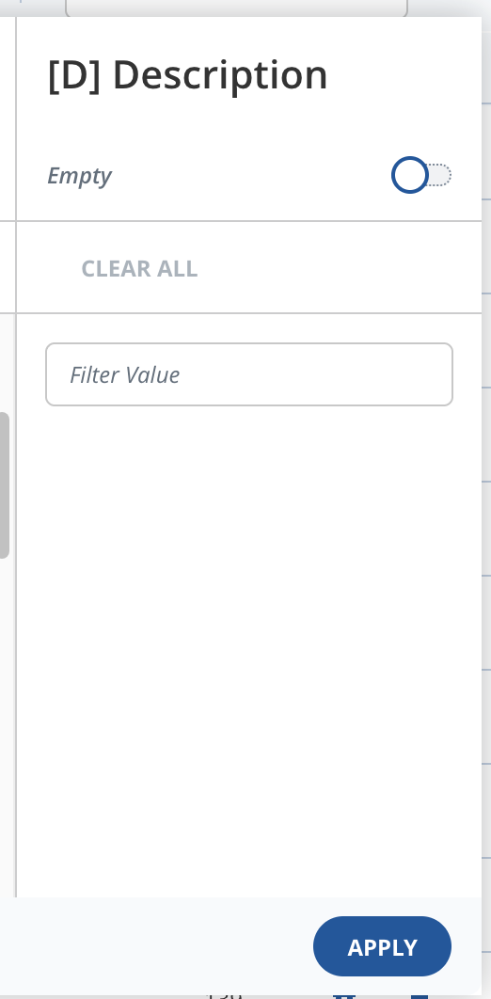

There are three behaviors to perform filtering on string fields: *_Exact match search_* and *_Simple search_*. The default behavior is exact match search.

* An link:/docs/DATA_SERVICES/dataservices-documentation-src/index.html#_exact_match_operator[Exact match search] looks for the exact value provided for the current string field, with or without case sensitivity. Substring or partial matching is not available.
* The link:/docs/DATA_SERVICES/dataservices-documentation-src/index.html#simple-search-operator[Simple search] uses a case-insensitive substring match algorithm to search the current string field.
* The link:/docs/DATA_SERVICES/dataservices-documentation-src/index.html#undefined-match-operator[Undefined match] looks for any empty value in the current string field.

To enable simple search, find the string field in the Document Model and add the *_enable_approximate_match_search_* annotation with the value *_true_*.
When filtering, the keyword will be split into words by whitespace and connected using the `and` operator. For example, if the keyword is _Tennisball Pack_, it will be split into _Tennisball_ and _Pack_. Below is the operator in the query constraint that will be sent to the server:

[source,json,options="nowrap",title="Splitted keyword example"]
----
{
    "operator": "and",
    "operands": [
      {
        "operator": "simple_search",
        "fields": [
          "/product/name"
        ],
        "value": "Tennisball"
      },
      {
        "operator": "simple_search",
        "fields": [
          "/product/name"
        ],
        "value": "Pack"
      }
    ]
  }
----

The query with this operator will look for documents containing both _Tennisball_ and _Pack_ in the `/product/name` field.

If the *_enable_approximate_match_search_* annotation is not specified or explicitly set to *_false_*, exact match search is applied by default. The default behavior for exact match search is `caseSensitive` *_true_*. To enable *_case-insensitive_* search (`caseSensitive = false`), add the *_enable_case_insensitive_search_* annotation with the value *_true_* into the string element in the Document Model.

==== Filter String Fields with Multi-Select

When link:/docs/SME/sme-om-ba-docs/index.html#_filter_string_fields_with_multi_select[Filter String Fields with Multi-Select] is enabled, the string filter options are shown as a list of options like multi-select or enumeration.

A select option is available to search for _Empty_ values, which can be combined with other string value selections.

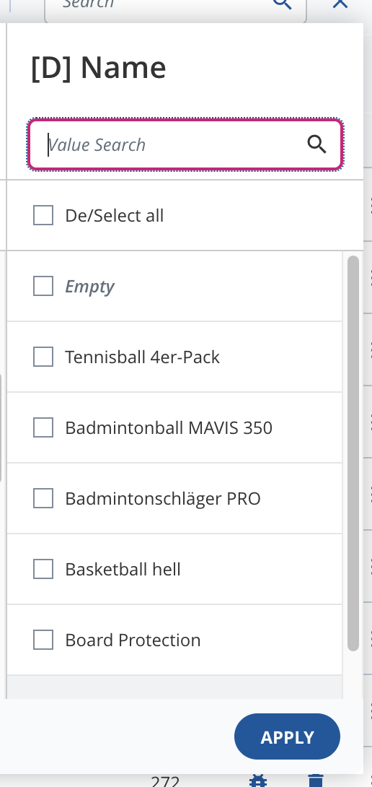

The behavior for filtering String Fields with Multi-Select is based on *_exact match search_* with `caseSensitive` *_true_*.

With _Empty_ option selected, it looks for any empty value in the current string field with the *_undefined match_* operator.

If multiple options are selected, the values are connected using the *_or_* operator.

=== Number

The number filter is an object with a start and an end value, both of type number.

The number filter options are visualized by default as two inputs, one for the start and one for the end value.

Beside the two inputs, there is a switch to search for _Empty_ values.

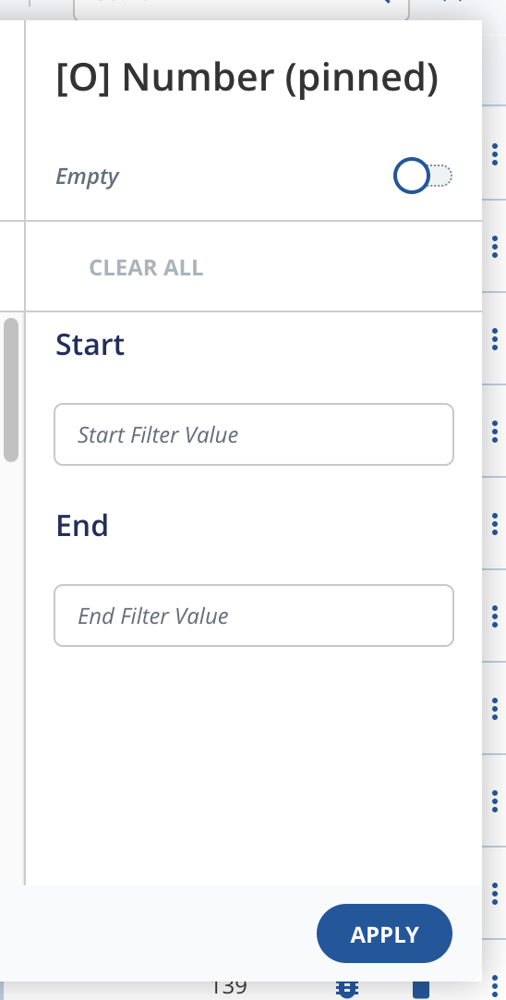

If _Empty_ switch is turned on, the result filter would look for any empty value in the current number field.

If one of the two values is filled:

- The value is entered into start field: the result filter would be larger than or equal to the value.
- The value is entered into end field: the result filter would be less than or equal to the enter value.

It is not possible to enter a number range with the start value larger than the end value.

=== Boolean

The boolean filter is an object with just the value of type boolean.

The boolean filter options are visualized by default as three radio buttons:

* *_Yes_* for *_true_*
* *_No_* for *_false_*
* *_Empty_* for *_null_*

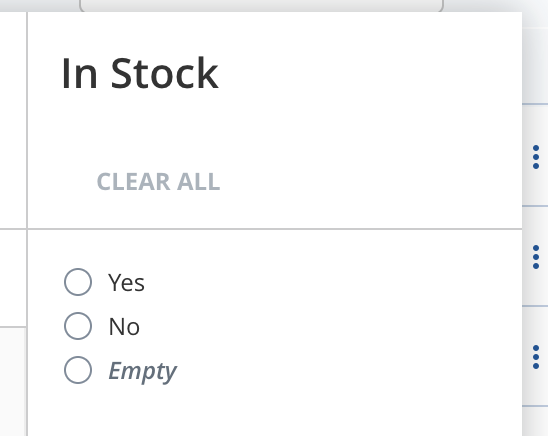

=== Confirm

The confirm filter is similar to the boolean filter, but with three radio button options: *_Yes_* and *_Empty_*.

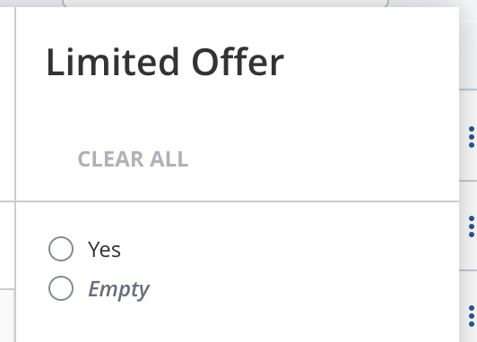

=== Enumeration

The enumeration filter is an object with the property `selectedValues`, which is an array of string values corresponding to the values of the selected enumeration options.

The enumeration filter options are visualized by default as a checkbox list of the enumeration options with localized labels.

A select option is included to search for _Empty_ values, which can be combined with other enumeration value selections.

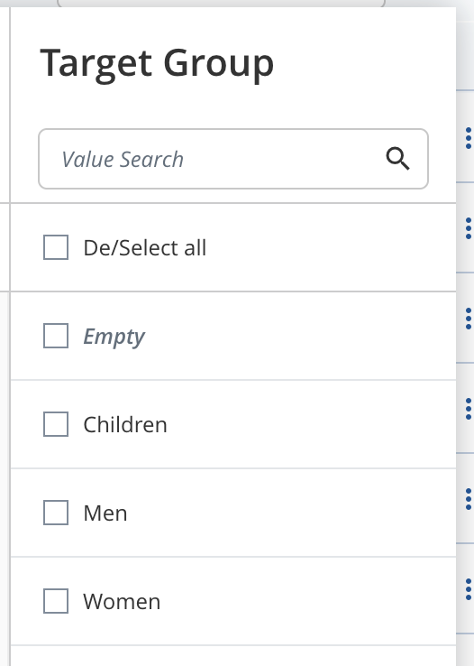

=== Multi-Select

The multi-select filter is an object that have two properties:

* `selectedValues`: contains multi-select value selected by users. It is an array of string values corresponding to the values of the enumeration field `value` inside the multi-select group.
* `operation`: the operator that is supposed to be used with `selectedValues`. It is of type link:./assets/generated/typedoc/enums/view_api.FilterOperation.html[FilterOperation] enum, which consists of two values `AND` and `OR`.

The multi-select filter options are visualized similarly to the enumeration filter, but with a Filter Operation button to set the operation. By default, the operation is `AND`.

A select option is available to search for _Empty_ values, which can be combined with other multi-select value selections.

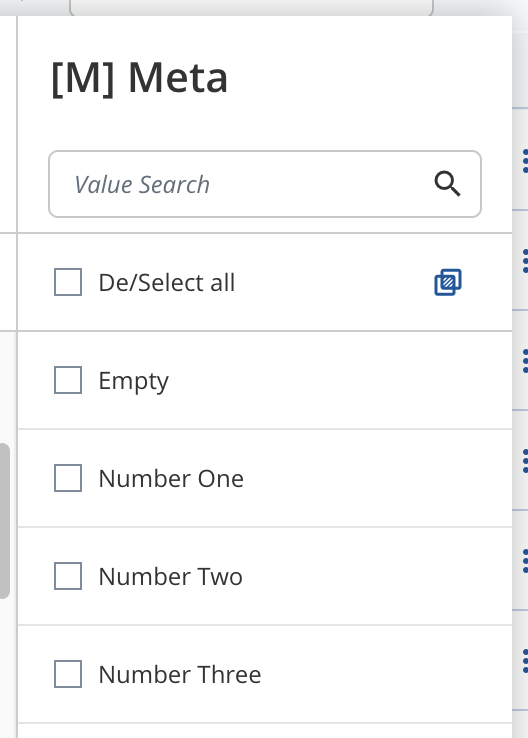

=== Date

The date filter is an object with a start and an end value, both of type Date.

The date filter options are visualized by default as two inputs, one for the start and one for the end value.
The start and end value are similar to the Number Filter Option, but the input is a date picker, or a combination of select elements.

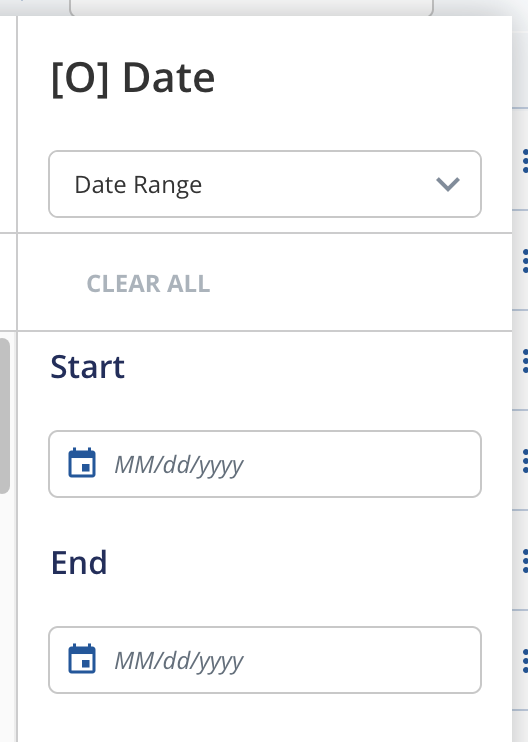

It is possible to filter by Month & Year Range (skipping the exact day) or only by Year Range (skipping the exact day and month).
Use the select element on top of the Date Filter Option to choose relevant mode. The default mode is Date Range. An _Empty_ option is also available in this select dropdown to search for empty values.

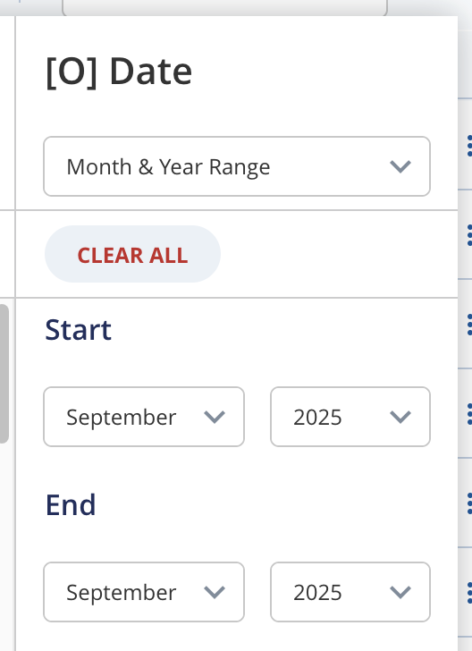
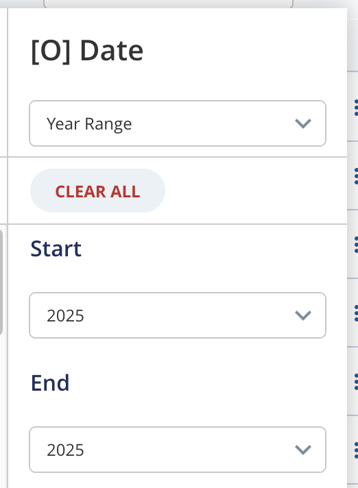

The resulting dates or date ranges are set as:

* Start value: first day of the month / year.
* End value: last day of the month / year.

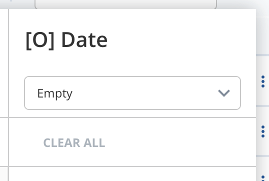

No input is required for this option.

=== Time

The time filter visualization is similar to the number filter option, but the input is a time picker.

Beside the two inputs, there is a switch on top to search for _Empty_ values.

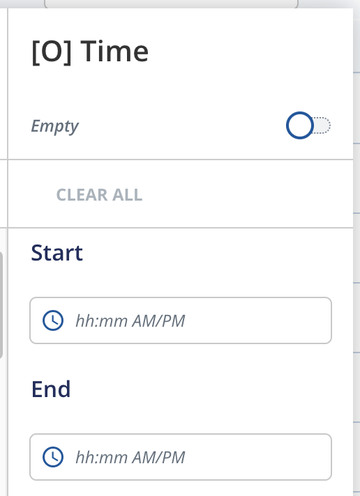

=== DateTime

The date time filter is similar to the date filter, with the difference, that the user can specify also the time here.

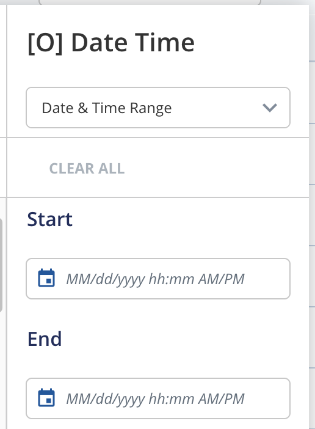

There are 6 convenient input modes:

* Date Range
* Date & Time Range
* Time Range
* Month & Year Range
* Year Range
* _Empty_

The Date Range, Month & Year Range, and Year Range are similar to the Date Filter Option. The time of the start field is set as `00:00:00`, and the time of the end field is set as `23:59:59`.

* Date & Time Range: inputs are datetime pickers, both date and time can be set.
* Time Range: similar to Time Filter Option, but the date is set to today.

[#hide-empty-value-option]
== Hiding Empty Value Options

All filter option views provide an _Empty_ switch or option to match `undefined` values. If you want to remove this choice from the UI, pass `hideEmptyValueOption` to the corresponding filter option view in the `componentMap`.

This flag is supported by the built-in views for String, Number, Boolean, Confirm, Enumeration, Multi-Select, Date, Time, and DateTime filters.

[source,typescript,options="nowrap",title="Hide the Empty option in filter views"]
----
const componentMap = {
  ...DefaultComponentMap,
  FilterOptionsViews: {
    ...DefaultComponentMap.FilterOptionsViews,
    StringFilterOptionsView: (props) => (
      <DefaultComponentMap.FilterOptionsViews.StringFilterOptionsView
        {...props}
        hideEmptyValueOption
      />
    ),
    DateFilterOptionsView: (props) => (
      <DefaultComponentMap.FilterOptionsViews.DateFilterOptionsView
        {...props}
        hideEmptyValueOption
      />
    )
  }
};
----

== How Field-Based Filtering Works

After clicking the **_Apply_** button,
the `link:./assets/generated/typedoc/interfaces/view_api.OverviewEngineApi.EventHandlers.html#onfilterchange[onFilterChange]`
event is called with a `link:./assets/generated/typedoc/interfaces/view_api.OverviewEngineApi.FilterMap.html[FilterMap]` containing
an updated *_active filters_*.
By default, this event will dispatch the `link:./assets/generated/typedoc/variables/store_internal_actions.Events.onFilterChanged.html[OverviewEngine/EVENT/onFilterChanged]`
action and the `activeFilters` is kept in link:./assets/generated/typedoc/interfaces/store_internal_store.UiState.html[uiState].

[NOTE]
====
Each entry in the `FilterMap` can specify a `modelId` property, which indicates the model (main document model or a submodel) where the field to be filtered resides.

When `filterMode` is `"custom_list"`, use the `subModel` property in `FieldConfiguration` to filter a field in a submodel. This will result in the corresponding `modelId` in the filter data.
If `subModel` is omitted, filtering applies to the current document model.

This mechanism is related to the link:/docs/OVERALL/heterogeneity/index.html[heterogeneity] feature in *A12*, allowing filters to target fields across different models and submodels.
====

Then the default data provider (by link:./assets/generated/typedoc/modules/client-extensions_internal_factories.OverviewEngineFactories.html[OverviewEngineFactories]) will use the `activeFilters` to create and send a search query to the server, which provides the documents displayed in the Overview Engine.

[#filters-control]
== Controlling The Active Filters

Overview Engine supports preset filters, which are active filters that are set when the engine is initialized. Depending on requirements, modeler and developer can work together to define suitable preset filters.

- In Overview Engine, the developer can set whether filters are removable or non-removable.
- In Overview Model, the modeler can set whether the Filter Bar and Filter Button should be displayed.
- If the Overview Model references a query model, its constraint behaves like a preset filter, always applies alongside the active filters, is joined with them using the `AND` operator, and stays hidden from the Filter Selector or Filter Bar.

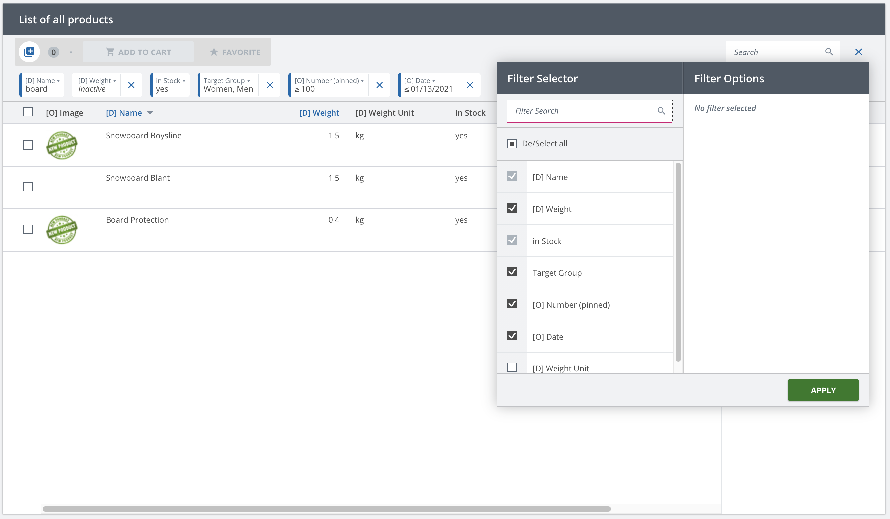

To build preset filters like that, Overview Engine needs to be initialized with an *_activeFilters_* list of type *_FilterMap_* and passed to the `uiState` of Overview Engine activity slices.
This can be done by registering a custom middleware in a module or in the application setup that intercepts `Activity.PUSH` actions and re-dispatches them with an initial filter configuration.
For example:

[source,typescript,options="nowrap",title="Create the preset filters"]
----
include::./assets/typescript/features/preset-filters.tsx[tags="preparePresetFilters"]
----

[source,typescript,options="nowrap",title="Example Middleware"]
----
include::./assets/generated/typescript/preset-filter-middleware.ts[tags="presetFilterMiddleware"]
----

In *_FilterMap_*, the key is the string based on _ModelPath_ of the field, for example: _"/product/name"_, _"/product/number"_,... The value is a *_Filter.Options_* with *_filterType_*, *_criteria_* and *_nonRemovable_*. If *_nonRemovable_* is set, this filter cannot be removed from either Filter Bar or Filter Selector.

The middleware example above is only one way to create preset filters at activity creation time. If you need to update the active filters during normal usage of the activity, dispatch an engine action instead:

* Use the event `Events.onFilterChanged` when you want to apply a new `activeFilters` list through the standard filtering flow.
* Use the command `Commands.setQueryParameters` when you want to update `activeFilters` together with other query parameters such as search, pagination, scrolling, or sorting.

Remember to wrap these actions with `OverviewEngineActions.event` or `OverviewEngineActions.command` so the update is scoped to the correct activity. See <<dispatch-engine-action,Dispatch an Engine Action>> for the dispatching pattern.

[#enumeratedStringFilter]
== Enumerated String Filtering

Enable link:/docs/SME/sme-om-ba-docs/index.html#_filter_string_fields_with_multi_select[Filter String Fields with Multi-Select] before using this feature.

This section will only focus on the customization in searching.

=== Event Handlers

The search enumerated string filter is handled by link:./assets/generated/typedoc/interfaces/view_api.OverviewEngineApi.EventHandlers.html#onsearchenumeratedstringfield[onSearchEnumeratedStringField] in `eventHandlers`.
By default this event will dispatch the `link:./assets/generated/typedoc/variables/client-extensions_internal_actions.OverviewEngineActions.enumeratedStringQueryParametersChanged.html[enumeratedStringQueryParametersChanged]` action.
Then the link:./assets/generated/typedoc/variables/client-extensions_internal_factories.OverviewEngineFactories.createApplicationSagas.html[default sagas] provided by link:./assets/generated/typedoc/modules/client-extensions_internal_factories.OverviewEngineFactories.html[OverviewEngineFactories] will handle this action to load list candidates and keep them in `link:./assets/generated/typedoc/interfaces/store_internal_store.UiState.html#enumeratedstringfiltermap[uiState.enumeratedStringFilterMap]`.

A customization could be done by overriding the event `onSearchEnumeratedStringField`. The following steps must be followed:

* Create data holders for `uiState.enumeratedStringFilterMap` correctly by dispatching action `link:./assets/generated/typedoc/variables/client-extensions_internal_actions.OverviewEngineActions.createEnumeratedStringDataHolder.html[createEnumeratedStringDataHolder]`.
Each field has a separated data holder, which contains the list of candidates and the search value.
* Dispatch the action `link:./assets/generated/typedoc/variables/client-extensions_internal_actions.OverviewEngineActions.setEnumeratedStringCandidates.html[setEnumeratedStringCandidates]` to update the list of candidates into these data holders.

=== Customization Example

The below example illustrates how to customize the search enumerated string filter:

[source,typescript,options="nowrap"]
----
export const EnumerationStringFilterExample = (props: OverviewEngineFactories.ViewComponentProps) => {
include::./assets/generated/typescript/custom-on-search-enumerated-string-field-event.tsx[tags="customOnSearchEnumeratedStringFieldEvent"]
	return <OverviewEngineFactories.ViewComponent {...props} eventHandlers={eventHandlers} />;
};

include::./assets/generated/typescript/handle-custom-event-saga.ts[tags="customEnumeratedStringQueryAction"]

----

The `customEnumeratedStringQuery` action should be handled by a saga:
[source,typescript,options="nowrap"]
----
include::./assets/generated/typescript/handle-custom-event-saga.ts[tags="customEnumeratedStringSearchingSaga"]
----

Remember to register this saga for current module.

== Result Page Customization

When there is no data for a given query (including searching and/or filtering), Overview Engine will show the default message "No results found" for clarification. It is straightforward to customize by overriding the default `TableBody` component, e.g:

[source,typescript,options="nowrap",title="Example"]
----
include::./assets/typescript/features/custom-components.tsx[tags="customTableBody"]
----

[#customizing-the-new-filter]
== Customizing The New Filter

The Filter Selector and Filter Bar described above are part of the *new filter*.
Beyond the model-driven configuration, the new filter exposes two programmatic customization points on `OverviewEngine`: the `componentMap.newFilter` for replacing UI, and the `eventHandlers.newFilter` for intercepting filter interactions.

[#new-filter-component-map]
=== Component Overrides

Every component the new filter renders is read from `componentMap.newFilter`, a link:./assets/generated/typedoc/interfaces/view_configuration_component-map.NewFilterComponentMap.html[NewFilterComponentMap].
This works like the rest of the <<_component_customization,componentMap>>: override only the keys you need and fall back to `DefaultComponentMap.newFilter` for the rest.

The override points are grouped by responsibility:

* *Layout / containers* — `FilterSelector`, `FilterBar`, `FilterSelectorTriggerButton`, `FilterSelectorFooter`, `FilterSelectorSearchBar`, `FilterSelectorSetting`, `OverviewHeading`, `OverviewSubheaderBox`, `SubHeader`.
* *Filter Bar items* — `FilterBarItem`, `FilterBarItemDropdown`.
* *Per-type editors* — the input shown when a filter is active: `StringFilterEditor`, `NumberFilterEditor`, `BooleanFilterEditor`, `ConfirmFilterEditor`, `EnumerationFilterEditor`, `MultiSelectFilterEditor`, `DateFilterEditor`, `DateFragmentFilterEditor`, `DateRangeFilterEditor`, `DateTimeFilterEditor`, `TimeFilterEditor`, `QueryFilterEditor`, plus the abstract `FilterEditor` wrapper and the `RangeFilterEditorTemplate` shared by range types.
* *Per-type settings* — the per-filter settings panel: `StringFilterSetting`, `NumberFilterSetting`, `BooleanFilterSetting`, `ConfirmFilterSetting`, `EnumerationFilterSetting`, `MultiSelectFilterSetting`, `DateFilterSetting`, `DateFragmentFilterSetting`, `DateRangeFilterSetting`, `DateTimeFilterSetting`, `TimeFilterSetting`, plus the abstract `FilterSetting` wrapper.
* *Actions / misc* — `FilterResetButton`, `FilterSettingButton`, `EmptyFilter`.

See link:./assets/generated/typedoc/interfaces/view_configuration_component-map.NewFilterComponentMap.html[NewFilterComponentMap] for the full list and the prop type of each component.

[source,typescript,options="nowrap",title="Override a new filter component"]
----
const componentMap = {
  ...DefaultComponentMap,
  newFilter: {
    ...DefaultComponentMap.newFilter,
    StringFilterEditor: (props) => (
      <DefaultComponentMap.newFilter.StringFilterEditor {...props} />
    )
  }
};
----

[#new-filter-event-handlers]
=== Event Handlers

The new filter reports each interaction through the `newFilter` group of
`link:./assets/generated/typedoc/interfaces/view_api.OverviewEngineApi.EventHandlers.html[OverviewEngineApi.EventHandlers]`.
Provide handlers under `eventHandlers.newFilter` to react to, or override, the default behavior. All handlers are optional.

* `onFilterSelectorOptionsChanged` — an active filter's options changed inside the Filter Selector (before Apply).
* `onFilterOptionsChanged` — the shared top-level options changed (e.g. `joinOperator` or `invert`).
* `onFilterSelectorAllApplied` — the *Apply* button in the Filter Selector was pressed (applies all active filters).
* `onFilterItemEditApplied` — the *Apply* button of a single Filter Bar item was pressed.
* `onFilterSelectorVisibilityChanged` — the Filter Selector was shown or hidden.
* `onFilterCollapsedChanged` — a filter group was collapsed or expanded.
* `onFilterItemOptionsChanged` — a single filter item's options changed.
* `onFilterItemReset` — a single filter item was reset.
* `onFilterSelectorReset` / `onFilterBarReset` — the Filter Selector or Filter Bar was reset.
* `onFilterBarItemsOverflowed` — dispatched when the Filter Bar does not have enough width to render all of its filter items. The handler receives the items that did not fit, and by default the engine moves these overflowed items into the Filter Selector so that they remain accessible.
* `onFilterItemEditStarted` / `onFilterItemEditCanceled` — editing of a Filter Bar item started or was canceled.
* `onFilterItemSettingsOpened` / `onFilterItemSettingsClosed` — a filter item's settings panel was opened or closed.

Each handler corresponds to an action in the `Events.NewFilter` namespace.
To react to these events outside of `eventHandlers` (for example in a custom middleware or saga), see <<new-filter-events,New Filter Events>> and the <<dispatch-engine-action,dispatch>> / <<listen-to-engine-action,listen>> patterns.
