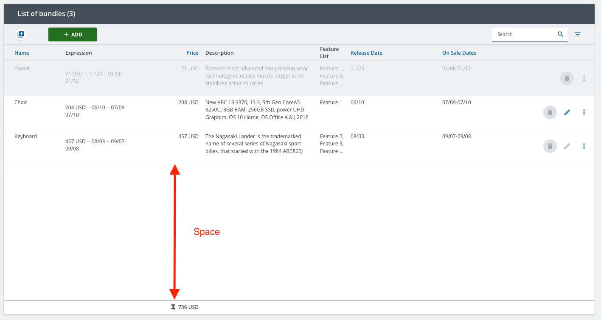

////
SPDX-License-Identifier: EUPL-1.2 OR LicenseRef-commercial
Copyright (c) 2012-2026 mgm technology partners GmbH
Dual License
This source file is part of the mgm A12 Platform and available under a choice of two different licenses:
1. Open-Source License - EUPL v1.2
You may redistribute and/or modify this file under the terms of the European Union Public License, version 1.2 - see https://eupl.eu/.
2. Commercial License
Alternatively, you may obtain a commercial license from mgm technology partners GmbH, that permits use of this software under different terms (including support and maintenance services).

Please contact a12-license@mgm-tp.com for more information.
    
You must select and comply with exactly one of the above license options.

Warranty Disclaimer (applies to either option)
THIS SOFTWARE IS PROVIDED "AS IS" AND WITHOUT WARRANTY OF ANY KIND, WHETHER EXPRESS OR IMPLIED, INCLUDING BUT NOT LIMITED TO THE WARRANTIES OF MERCHANTABILITY, FITNESS FOR A PARTICULAR PURPOSE AND NON-INFRINGEMENT, EXCEPT WHERE SUCH DISCLAIMERS ARE HELD TO BE LEGALLY INVALID. SEE THE RESPECTIVE LICENSE TEXT FOR DETAILS. 
////
[#infinite-scroll]
= Infinite Scroll

Overview Engine also supports infinite-scroll behavior.
When this feature is enabled, the table will load more rows as user keeps scrolling down.
This is an alternative to pagination in Overview Engine and can bring better UI/UX in some particular cases.

NOTE: The infinite-scroll feature only supports fixed height rows

To enable infinite-scroll in Overview Engine, it should be specified in the model and configured in `OverviewEngine` component through public APIs.
For more details about modelling, please see the link:/docs/SME/sme-om-ba-docs/index.html#_paging_behavior[SME docs]. This section only focuses on how to use the APIs.

NOTE: Since the height of the table body is fixed in infinite scrolling tables, the footer is always stuck at the bottom of the table body, even if the table rows are short. This is a non-covered edge case.

== API

To enable infinite-scrolling, the props passed to `OverviewEngine` component should be of the type link:./assets/generated/typedoc/interfaces/view_overview-engine.OverviewEngine.InfiniteScrollProps.html[OverviewEngine.InfiniteScrollProps].
This means that `data` prop can receive a discontinuous array and `infiniteScrollOptions` must be specified.

The `infiniteScrollOptions` prop is used for controlling the behavior.
It receives an object of type `OverviewEngineApi.InfiniteScrollOptions` which is similar to `InfiniteScrollOptions` in Widget.

`OverviewEngineApi.InfiniteScrollOptions` has the following fields:

* `rowCount`: receives the total number of rows.
* `rowLoadingStatus`: receives a callback to identify if a row is unloaded or loading or loaded.
The callback takes the index of a row and should return `RowLoadingStatus` for the row.The callback receives the index of a row and should return the corresponding `RowLoadingStatus`.
* `loadData`: a callback that loads and updates data by creating a
link:./assets/generated/typedoc/interfaces/client-extensions_internal_data-loader_data-loader.DataOperation.ListDocuments.Query.html[DataOperation.ListDocuments.Query]
with the appropriate link:./assets/generated/typedoc/interfaces/client-extensions_internal_data-loader_data-loader.DataOperation.ListDocuments.Paging.html[DataOperation.ListDocuments.Paging] parameter.
This callback will be triggered when more data need to be loaded. It receives an object parameter which contains the following fields:
** `startPage`: indicating the number of page to start loading. *_This is 0-based_*.
** `endPage`: indicating the number of page (inclusive) to end loading. *_This is 0-based_*.
* `threshold`: to specify when to pre-fetch data. A threshold *X* means that the next rows will start loading when a user scrolls within *X* last rows
* `minimumBatchSize`: minimum number of rows to be loaded at a time
* `loaderRef`: the React reference to the underlying `InfiniteLoader` from `react-virtualized`. It has a useful method `resetLoadMoreRowsCache` to reset the internal cache. This should be called when all the rows should be re-fetched.
* `overrideListProps`: to override the props of `react-virtualized` list rendered under the hood. There are some useful props such as `scrollToRow` and so on.

== Configurations

Overview Engine provides configurations for the infinite scrolling behavior through `OverviewEngineFactories`.

These configurations control how infinite scrolling operates in the OverviewEngine:

- `pageSize`: Defines the number of rows to load per page. A larger `pageSize` reduces the number of requests but
increases the amount of data loaded at once.
- `cachePages`: Specifies the number of pages to retain in the cache while scrolling. This optimizes performance by
reducing the need to re-fetch data when scrolling back. The default value is *5*.

[NOTE]
.OverviewEngine calculation
====
The number of documents per one load by `pageSize * ( endPage - startPage + 1 )`.

The total number of cached rows is calculated as `pageSize * cachePages`.
====

[source,typescript,title="Setup the Overview Engine infinite scroll configurations"]
----
include::./assets/typescript/features/custom-infinite-scroll-setup.ts[tags="main"]
----

