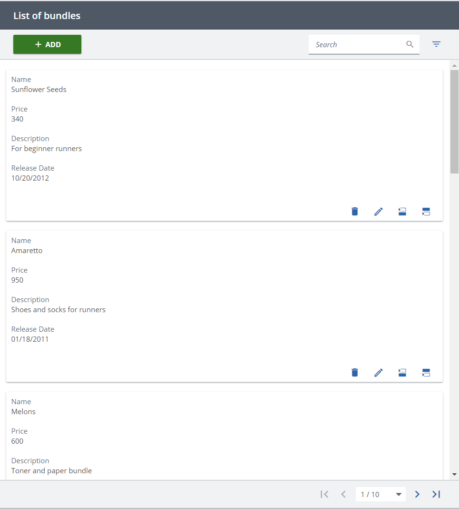
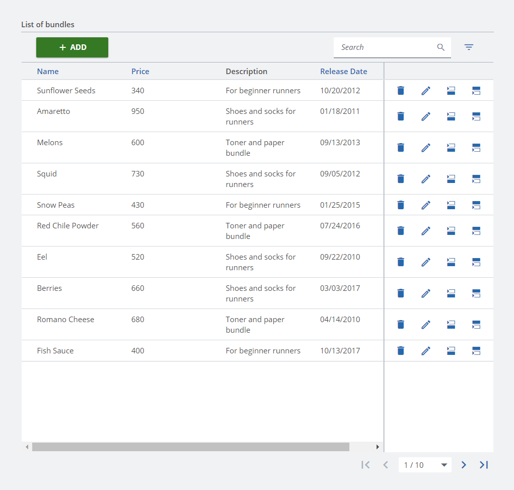

////
SPDX-License-Identifier: EUPL-1.2 OR LicenseRef-commercial
Copyright (c) 2012-2026 mgm technology partners GmbH
Dual License
This source file is part of the mgm A12 Platform and available under a choice of two different licenses:
1. Open-Source License - EUPL v1.2
You may redistribute and/or modify this file under the terms of the European Union Public License, version 1.2 - see https://eupl.eu/.
2. Commercial License
Alternatively, you may obtain a commercial license from mgm technology partners GmbH, that permits use of this software under different terms (including support and maintenance services).

Please contact a12-license@mgm-tp.com for more information.

You must select and comply with exactly one of the above license options.

Warranty Disclaimer (applies to either option)
THIS SOFTWARE IS PROVIDED "AS IS" AND WITHOUT WARRANTY OF ANY KIND, WHETHER EXPRESS OR IMPLIED, INCLUDING BUT NOT LIMITED TO THE WARRANTIES OF MERCHANTABILITY, FITNESS FOR A PARTICULAR PURPOSE AND NON-INFRINGEMENT, EXCEPT WHERE SUCH DISCLAIMERS ARE HELD TO BE LEGALLY INVALID. SEE THE RESPECTIVE LICENSE TEXT FOR DETAILS. 
////
= Display Modes

Apart from the default look, Overview Engine can also be displayed in two other forms:  `cardView` and `embedded`.

== Card View

Once the card view mode is enabled, each row is displayed as a card. All cells in a row are rendered vertically instead of horizontally.
Therefore, this mode is appropriate for screens or containers that have limited width.

Card view mode can be turned on by setting `cardView` prop in `OverviewEngine` component to *true* .
Here is an example result:

== Embedded

Sometimes, there is a need to have an Overview Engine inside another container. However, the default look is usually not suitable for this case. For example, `OverviewEngine` renders not only a table, but also a content-box, which may not look good if the container already renders its own content-box. Therefore, we provide this mode to help solve that situation.

Embedded mode can be enabled by turning on `embedded` prop in `OverviewEngine` component.
The following example demonstrates an embedded one:

